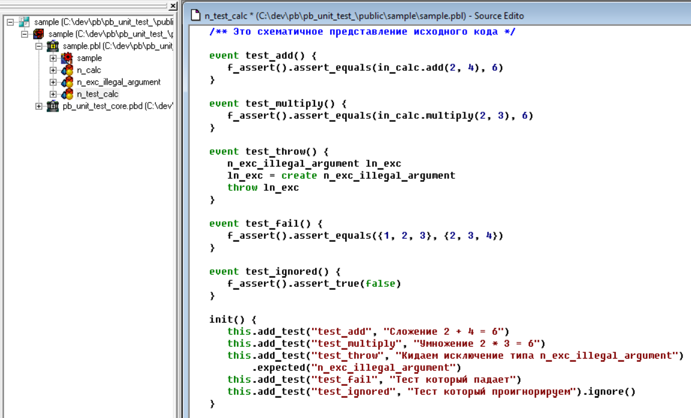

# PBUnitTest




## Getting Started

Установить все зависимости

```
PowerGen
Java JDK 1.8
Ant 1.9.15
Git 2.25
PowerBuilder 9.0.3 build 8716
PushOk GITSCC
```

## Сборка проекта

Полная сборка производится с помощью *Ant'а* (см. *build.xml*).

```
cd pb_unit_test
ant clean make-project
```

Открыть проект в среде

```
pb90.exe pb_unit_test.pbw
```

Запустить приложение (настроить Git SCC)

```
Основное меню -> Run -> Run pb_unit_test(Ctrl+R)
```

## Структура
```
pb_unit_test.pbl
    точка входа
pb_unit_test_api.pbl
    api для создания окружения и запуска тестов из командной строки
pb_unit_test_core.pbl
    ядро
pb_unit_test_gui.pbl
    визуалка для запуска тестов
pb_unit_test_reflection.pbl
    классы для определения списка тестов, подключения библиотек по указанному таргету
pb_unit_test_runner.pbl
    классы для выполнения тестов
```
#### Чтобы запустить тесты, нужно
* Создать приложение и подключить библиотеку `pb_unit_test_core.pbd`;
* Наследоваться от классов:
```
`n_test_case` - обычный единичный тест
	переопределить событие run -> здесь пишется тест
	определить свойства
		is_description
			описание теста
		ib_ignore
			флаг, игнорировать при проверке
			
		Эти свойства трогать не надо:
			is_library_name
			is_object_name
			is_event_name
```
```
`n_test_suite` - набор тестов
	каждый новый тест, это новое созданное событие, с любым именем, без результата и параметров
	переопределить метод init -> здесь привязываем наши тесты, с помощью метода add, который возвращает ссылку на n_test_case
		Например:
			this.add("test_add", "Тестируем сложение")

	определить свойства
		is_description
			описание группы тестов

	Дополнительные методы n_test_case
		ignore() - игнорировать тест
		expected(string) - передать имя класса исключения, которое должен кинуть тест. Если этого не произойдет - тест не пройден

	Для проверки результат необходимо использовать класс проверок n_assert (вызывать с помощью функции f_assert).
	Который будет кидать исключение n_assertion_error, когда сравниваемый результат не совпадате и как следствие
	тест будет отмечен, как не пройденный.
```

##### Список методов n_assert:
```
assert_equals - падает, если два объекта или примитива не равны (или массивы)
assert_not_equals - падает, если два объекта или примитива равны
assert_false - падает, если значение не FALSE
assert_true - падает, если значение не TRUE
assert_null - падает, если значение NULL
assert_not_null - падает, если значение не NULL
assert_same - падает, если два объекта не один и тот же объект
assert_not_same - падает, если два объекта один и тот же объект
assert_valid - падает, если объект не валиден
assert_not_valid - падает, если объект валиден
fail - ошибка теста с заданным текстом
```

**Внимание!**
```
При конвертации в string, если объект содержит публичный метод string to_string(), то выполняется его запуск
При сравнении 2х объектов, еслио объекты принадлежат к одному родителю и он содержит метод 
boolean equals(PowerObject parentClassReference), то динамически вызывается он, иначе будет проверка return (a = b).
```
Запуск тестов происходит только из собранной версии утилиты.
```
В таргете, который мы хотим проверить, должен быть подключен набор библиотек тестов.
Тесты могут располагаться где угодно.
```
Параметры для запуска консольной версии
```
Основной ключ test, далее следуют параметры:

/test.all - искать всё найденые тесты
/test.library=libraryname[,libraryname,libraryname...] - искать тесты в заданном списке библиотек, где разделитель запятая
/target=path - путь к таргету
/log.file=path - путь к лог-файлу вывода

pb_unit_test.error.log - лог ошибок
pb_unit_test.output.log - лог вывода по умолчанию
```
Пример консольной команды
```
pb_unit_test.exe test /test.all /target=c:\dev\pb\ws\my_app\my_app.pbt
```
**Внимание!**
```
Если параметры не указаны, то тестирование будет происходит по таргету, найденному в каталоге, где запустили утилиту, по всем тестам.
Если не задан ключ `test`, то будет запущена визуальная версия приложения, где можно указывать нужный таргет и выполнять выборочный запуск тестов.
```
